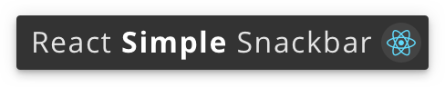

<p align="center">
  
</p>

<p align="center">
  <a
    href="https://www.npmjs.com/package/react-simple-snackbar"
    title="NPM Version"
    target="blank"
  >
    
  </a>
  <a
    href="https://travis-ci.org/evandromacedo/react-simple-snackbar"
    title="Build Status"
    target="blank"
  >
    
  </a>
  <a
    href="https://coveralls.io/github/evandromacedo/react-simple-snackbar?branch=master"
    title="Coverage Status"
    target="blank"
  >
    
  </a>
  <a href="#" title="Gzipped size">
    
  </a>
  <a href="https://standardjs.com" title="JavaScript Style Guide" target="blank">
    
  </a>
  <a
    href="https://github.com/evandromacedo/react-simple-snackbar/blob/master/LICENSE.md"
    title="MIT License"
    target="blank"
  >
    
  </a>
</p>

You can check a quick demo [here](https://evandromacedo.github.io/react-simple-snackbar/).

## Getting Started

### Installation

```
npm install --save react-simple-snackbar
```

or

```
yarn add react-simple-snackbar
```

### Basic Usage

First, you need to wrap your application into a `SnackbarProvider`:

```jsx
// App.js
import React from 'react'
import SnackbarProvider from 'react-simple-snackbar'
import SomeChildComponent from './SomeChildComponent'

export default function App() {
  return (
    <SnackbarProvider>
      <SomeChildComponent />
    </SnackbarProvider>
  )
}
```

Then you can use both options on any descendant component:

#### 1. `useSnackbar()` hook on function components

<!-- prettier-ignore -->
```jsx
// SomeChildComponent.js
import React from 'react'
import { useSnackbar } from 'react-simple-snackbar'

export default function SomeChildComponent() {
  const [openSnackbar, closeSnackbar] = useSnackbar()

  return (
    <div>
      <button onClick={() => openSnackbar('This is the content of the Snackbar.')}>
        Click me to open the Snackbar!
      </button>
      <button onClick={closeSnackbar}>
        Click me to close the Snackbar programmatically.
      </button>
    </div>
  )
}
```

#### 2. `withSnackbar()` HoC on class components

<!-- prettier-ignore -->
```jsx
// SomeChildComponent.js
import React from 'react'
import { withSnackbar } from 'react-simple-snackbar'

class SomeChildComponent extends React.Component {
  render() {
    const { openSnackbar, closeSnackbar } = this.props

    return (
      <div>
        <button onClick={() => openSnackbar('This is the content of the Snackbar.')}>
          Click me to open the Snackbar!
        </button>
        <button onClick={closeSnackbar}>
          Click me to close the Snackbar programmatically.
        </button>
      </div>
    )
  }
}

export default withSnackbar(SomeChildComponent)
```

## API

### Methods

These methods are are returned from `useSnackbar()` hook in array destructuring syntax:

```js noLines
const [openSnackbar, closeSnackbar] = useSnackbar()

// You can also give different names as you wish
const [open, close] = useSnackbar()
```

Or added as additional props on components wrapped in `withSnackbar()`:

```js noLines
const { openSnackbar, closeSnackbar } = this.props
```

#### `openSnackbar(node [, duration])`

- **`node`**: the node you want to show into the Snackbar. It can be just `"Some string like showed on Basic Usage"`, or `<p>Some element you would <strong>like</strong> to show</p>`.

- **`duration`**: a number in milliseconds to set the duration of the Snackbar. The default value is `5000`.

#### `closeSnackbar()`

- This method is used if you want to close the Snackbar programmatically. It doesn't receive any params.

### Options

You can pass an options object to customize your Snackbar. This object can be passed either in `useSnackbar([options])` or as second argument of `withSnackbar(Component [, options])`. It accepts three options:

- **`position`**: a custom position for your Snackbar. The default value is `bottom-center`, and the possible values are `top-left`, `top-center`, `top-right`, `bottom-left`, `bottom-center` and `bottom-right`.

- **`style`**: a [style object](https://reactjs.org/docs/dom-elements.html#style) with `camelCased` properties and string values. These styles are applied to the Snackbar itself.

- **`closeStyle`**: same as above, but the styles are applied to the close button. You can use font properties to style the `X` icon.

For example:

```jsx noLines
const options = {
  position: 'bottom-right',
  style: {
    backgroundColor: 'midnightblue',
    border: '2px solid lightgreen',
    color: 'lightblue',
    fontFamily: 'Menlo, monospace',
    fontSize: '20px',
    textAlign: 'center',
  },
  closeStyle: {
    color: 'lightcoral',
    fontSize: '16px',
  },
}

// Usage with hooks
useSnackbar(options)
// Usage with HoC
withSnackbar(Component, options)
```

## Testing

> The snackbar itself is [already tested](https://github.com/evandromacedo/react-simple-snackbar/tree/master/src/__tests__) and you don't have to worry about it.

To test components that use Snackbar functionalities, there are some approaches as described bellow. This examples makes use of [Jest](https://jestjs.io/) and [Enzyme](https://airbnb.io/enzyme/) for testing, but you can use whatever you want.

### Testing components that use `useSnackbar()` hook

You can mock the implementation of `useSnackbar` to return an array containing `openSnackbar` and `closeSnackbar` as mocked functions:

<!-- prettier-ignore -->
```jsx
// Component.test.js
import React from 'react'
import { shallow } from 'enzyme'
import * as Snackbar from 'react-simple-snackbar'
import Component from './Component'

// Mocks the open and close functions
const openSnackbarMock = jest.fn()
const closeSnackbarMock = jest.fn()
jest.spyOn(Snackbar, 'useSnackbar').mockImplementation(() => [openSnackbarMock, closeSnackbarMock])

it('can test the openSnackbar and closeSnackbar functions', () => {
  const wrapper = shallow(<Component />)

  // Simulates click on some buttons that opens and closes the Snackbar
  wrapper.find('button.open').simulate('click')
  wrapper.find('button.close').simulate('click')

  // Some examples of how you can test the mocks
  expect(openSnackbarMock).toHaveBeenCalled()
  expect(openSnackbarMock).toHaveBeenCalledTimes(1)
  expect(openSnackbarMock).toHaveBeenCalledWith('This is the text of the Snackbar.')
  expect(closeSnackbarMock).toHaveBeenCalled()
  expect(closeSnackbarMock).toHaveBeenCalledTimes(1)
})
```

### Testing components wrapped in `withSnackbar()` HoC

To make it easier to test and not make use of `SnackbarProvider`, you can export your component in isolation as a named export, and as a default export wrapped in `withSnackbar()`:

```jsx
// Component.js

// (...)
// * Here goes all the component's code *
// (...)

// Named export for testing, and default export for using
export { Component }
export default withSnackbar(Component)
```

So you can get the component as a named import, then mock the `openSnackbar` and `closeSnackbar` functions as common props if you want:

```jsx
// Component.test.js
import React from 'react'
import { shallow } from 'enzyme'
import { Component } from './Component'

it('can test the openSnackbar and closeSnackbar functions', () => {
  const openSnackbarMock = jest.fn()
  const closeSnackbarMock = jest.fn()
  const wrapper = shallow(
    <Component openSnackbar={openSnackbarMock} closeSnackbar={closeSnackbarMock} />
  )

  // Simulates click on some buttons that opens and closes the Snackbar
  wrapper.find('button.open').simulate('click')
  wrapper.find('button.close').simulate('click')

  // Some examples of how you can test the mocks
  expect(openSnackbarMock).toHaveBeenCalled()
  expect(openSnackbarMock).toHaveBeenCalledTimes(1)
  expect(openSnackbarMock).toHaveBeenCalledWith('This is the text of the Snackbar.')
  expect(closeSnackbarMock).toHaveBeenCalled()
  expect(closeSnackbarMock).toHaveBeenCalledTimes(1)
})
```

## Contributing

See [CONTRIBUTING](https://github.com/evandromacedo/react-simple-snackbar/blob/master/CONTRIBUTING.md) for more information on how to get started.

## License

React Simple Snackbar is open source software [licensed as MIT](https://github.com/evandromacedo/react-simple-snackbar/blob/master/LICENSE.md).
